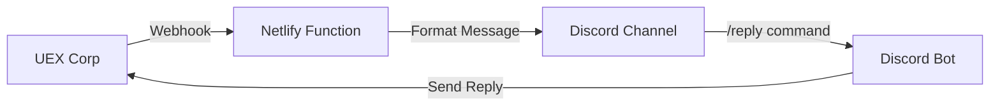

# UEX-Discord Integration

**Free serverless bridge between UEX Corp marketplace and Discord**

Get instant Discord notifications when someone messages your UEX Corp listings, and reply directly from Discord without opening the website. No monthly fees, no server maintenance required.

  

## 🎯 What This Does

**Turn your Discord into a UEX Corp command center:**

- 🔔 **Instant Notifications**: Get rich Discord messages when someone replies to your UEX listings
- 💬 **Reply from Discord**: Respond to negotiations using `/reply` commands  
- 📊 **Always Online**: Runs 24/7 on Netlify's free tier (125k requests/month)
- 🔒 **Private & Secure**: Only you see your notifications, your API keys stay safe
- 💰 **Completely Free**: No subscriptions, no usage limits, no hidden costs

## 📱 What You'll See

When someone messages your UEX Corp listing:

```
🔔 New UEX Message
Polaris - LTI Package

👤 From: SpacePilot42
📝 Message: "Is this still available? Can you do 15% off?"

💬 To Reply:
/reply abc123 Yes! I can do 10% off for immediate payment

Negotiation: abc123def456...
```

## 🚀 Quick Start

**⏱️ Setup time: ~15 minutes**

1. **[Fork this repository](../../fork)** 
2. **Deploy to Netlify** (free hosting)
3. **Set up Discord webhook** (for notifications)
4. **Get UEX Corp API keys** (for sending replies)
5. **Configure webhooks** in UEX Corp

**👉 [Complete Setup Guide in Wiki](../../wiki/Setup-Guide)**

## 📚 Documentation

| Topic | Description |
|-------|-------------|
| **[📖 Setup Guide](../../wiki/Setup-Guide)** | Complete step-by-step installation |
| **[🔑 Getting API Keys](../../wiki/Getting-API-Keys)** | How to get UEX Corp and Discord credentials |
| **[🤖 Discord Bot Setup](../../wiki/Discord-Bot-Setup)** | Enable `/reply` slash commands (optional) |
| **[🔧 Troubleshooting](../../wiki/Troubleshooting)** | Common issues and solutions |
| **[⚙️ Advanced Configuration](../../wiki/Advanced-Configuration)** | Custom domains, security, monitoring |

## 🎬 Demo

### Before (Manual)
- Check UEX Corp website constantly for new messages
- Switch between Discord and UEX Corp to respond
- Miss messages when away from computer

### After (Automated)
- Get instant Discord notifications with full message context
- Reply directly from Discord without opening UEX Corp
- Never miss a negotiation, even on mobile

## ✅ Requirements

- **UEX Corp account** with API access
- **Discord server** (can be just you)
- **Free accounts on:**
  - [GitHub](https://github.com) (code hosting)
  - [Netlify](https://netlify.com) (free serverless hosting)

**No coding knowledge required** - just copy/paste configuration values.

## 🔧 How It Works



1. **UEX Corp** sends webhook when someone messages your listing
2. **Netlify function** receives webhook and formats it nicely  
3. **Discord** shows rich notification in your channel
4. **You reply** using `/reply` command or web interface
5. **Your message** gets sent back to UEX Corp automatically

## 🆚 Alternatives

| Solution | Cost | Setup | Limitations |
|----------|------|-------|-------------|
| **This Project** | Free | 15 min | None |
| Manual checking | Free | 0 min | Miss messages, slow |
| Pipedream | Free → $19/mo | 10 min | Usage limits |
| Zapier | $20+/mo | 5 min | Expensive |
| Custom server | $5+/mo | Hours | Maintenance |

## 🔒 Security & Privacy

- ✅ **Open source** - verify the code yourself
- ✅ **Your credentials** stay in your Netlify account (never shared)
- ✅ **No tracking** - we don't collect any data
- ✅ **Webhook signatures** supported for additional security
- ✅ **Private notifications** - only you see your messages

## 🏆 Success Stories

> *"I was missing 30% of my UEX Corp messages before this. Now I respond within minutes and close deals faster!"* - UEX Trader

> *"Setup took 12 minutes following the wiki guide. Been running flawlessly for 3 months."* - Discord User

> *"The Discord notifications are perfectly formatted. Much better than email alerts."* - Marketplace Seller

## 🤝 Contributing

We welcome contributions! Here's how to help:

- 🐛 **Report bugs** in [Issues](../../issues)
- 💡 **Suggest features** in [Discussions](../../discussions)  
- 📖 **Improve documentation** in [Wiki](../../wiki)
- 🔧 **Submit code** via [Pull Requests](../../pulls)

**[Development Setup Guide](../../wiki/Development-Setup)**

## ⭐ Show Your Support

If this project helps you, please:
- ⭐ **Star this repository**
- 🔄 **Share with other UEX traders**  
- 💬 **Join our [Discord community](https://discord.gg/your-invite)**
- 📝 **Write a review** in [Discussions](../../discussions)

## 📄 License

**MIT License** - Use freely for personal or commercial projects.

See [LICENSE](LICENSE) for details.

## 📞 Support

**Need help?** Check these resources in order:

1. 📖 **[Wiki Documentation](../../wiki)** - Comprehensive guides and FAQ
2. 🔍 **[Search Issues](../../issues)** - See if someone had the same problem  
3. 💬 **[Start Discussion](../../discussions)** - Ask questions and share ideas
4. 🐛 **[Report Bug](../../issues/new)** - If you found a genuine issue

**Response time: Usually within 24 hours**

---

## 🚀 Ready to Get Started?

**👉 [Start with the Setup Guide](../../wiki/Setup-Guide)**

*Built by UEX traders, for UEX traders. Get your Discord notifications working in 15 minutes.* 🎯 